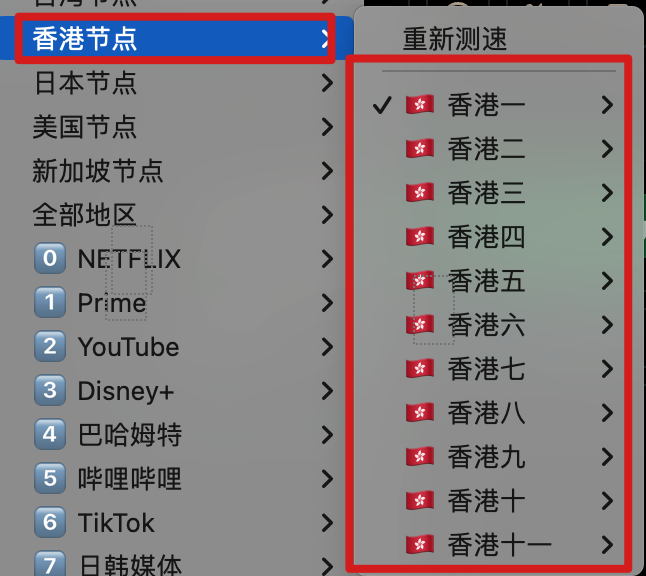
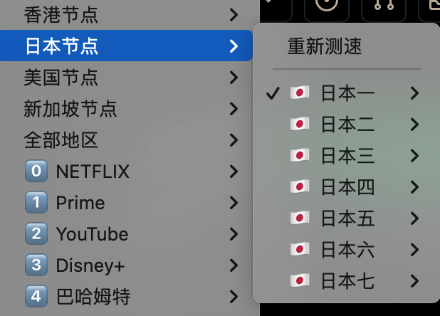
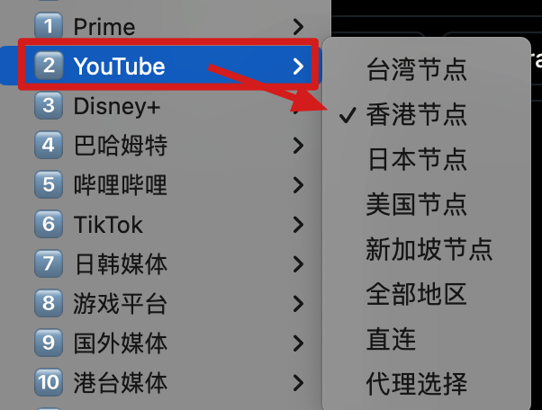
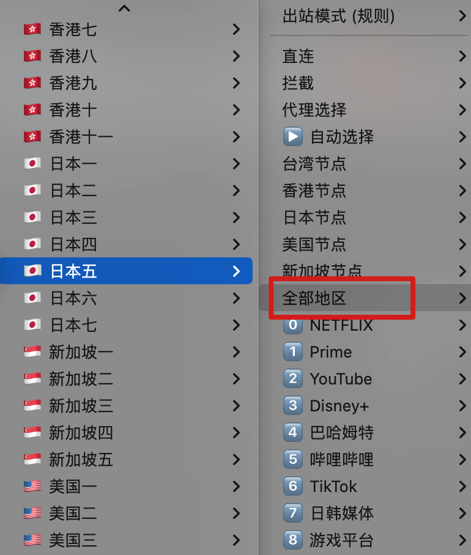

# 功能
clash配置文件
- 此配置文件可永久使用（换订阅也可使用）
- 所有clash订阅或者通用地址可用；
- 支持排除指定关键词的节点；（可去除含“倍速，X或其他指定关键词的节点”）
- 支持筛选指定地区的节点（如美国、香港，并按地区分组供其他策略组使用）
- 支持给某个策略组分配指定地区的节点；
- 按地区或关键词分组的节点支持fallback测试；
- 较完善的国外规则；
- 自动测速选择最佳节点（支持排除不参与测速的节点）；

# 2023.9.24更新
增加了几个常用的国外网站的代理规则；

# 目前支持的策略组
- 谷歌
- spotify
- netflix
- Prime
- youtube
- 迪士尼
- bilibili
- Tiktok
- 日韩媒体
- 游戏平台
- 国外媒体
- 港台媒体
- 国外网站（按IP和域名归类）
- 国内网站（按IP和域名归类）
- 电报
- 苹果
- 直连
- 未在规则内的（默认为直连）

# 2023.9.5更新

- clash支持排除指定关键词的节点；
- clash增加谷歌服务策略组
- clash其他国外规则更新

# 所有配置文件说明
该配置文件能筛选出不同地方和名称的节点，并将这些节点分组；这些节点被分组后在策略组中被进行fallback或者url-test测试供其他策略组使用；

所有配置文件，均可以直接替换文件中的订阅地址为你的使用配置； 

这样很方便在你切换不同机场的时候需要同一份配置文件的时候使用；

配置文件都支持将机场按照名称和地点进行分组后再进行策略组的选择；

  

    

## 注意，该自用配置文件只支持这些节点的筛选
- 含有明确的“香港、台湾、美国”等名称的节点；
- 部分含有🇨🇳符号的节点服务器；
- 通用订阅地址（专用客户端地址未测试）；
  

      

# 各个配置文件说明
- 部分内容有搜集和参考仓库其他作者的配置文件后整理修改

##待补充......
